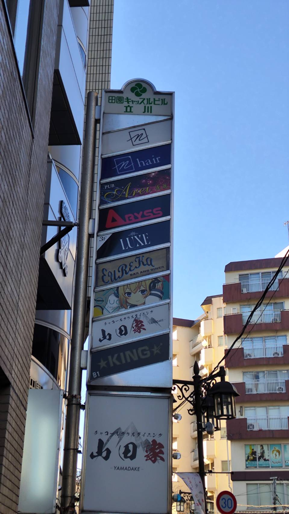
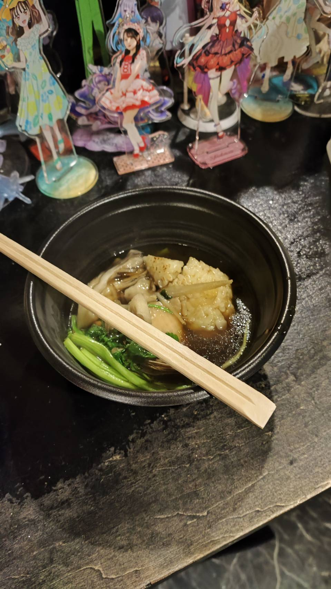

# アニソン、やっぱり好きだ
先日、立川に2週間ほどお泊まりすることになり、週末暇だな〜なんかやることないかな〜ととあるシリーズの自販機を探して彷徨う人をやっていました。そして駅前の自販機を探しているとオタクホイホイな見た目の看板を出しているお店がありました。

**[Gluck Zwei](https://maps.app.goo.gl/gzHg6oKCHfV8WSap7)** という名前のお店なのですが、看板がアニメテイストで脳を焼かれました。

本当の話です。インターネットで調べると私の大学生の頃の後輩が何人かフォローしてい他のと、その日の14時からアニソンオンリーのDJイベントを行うというポストをしていたので、これはもう行くしかないとなり突然お邪魔させていただきました。

アニメが広く認知されてオタクを名乗っても犯罪者を見るような眼差しをされなくなって久しいですが、このアニクラの雰囲気がとても好きでした。周りがすごいオタクで、でもそれをみんなで認め合ってお互いに楽しんでいる雰囲気がとても懐かしく思わず泣いてしまいました。2010年代まで秋葉原が纏っていた雰囲気が確かにそこにはありました。
しかもDJの方々が私より少し年上の方が多く90年代や00年代のアニソンも多く流れていて、一般受けを気にしない刺さる人に刺さればよかった雰囲気のアニソン、オルタナティブポップとして浸透する前のいわゆるアニソンを浴びるように聞くことができました。

そこには身分は関係なく、ただ純粋にアニソンを楽しむ真の戦士しかいませんでした。

加えて、なぜかBarで美味しいきりたんぽ鍋を作っている料理人？がいらっしゃったので、かくいう私もしっかり頂いてきました。ガチ美味しかったです。また食べ行きたい。

[らきた様](https://x.com/gtubaP3/status/2014896959757467685?s=20) 、画像をお借りしました。